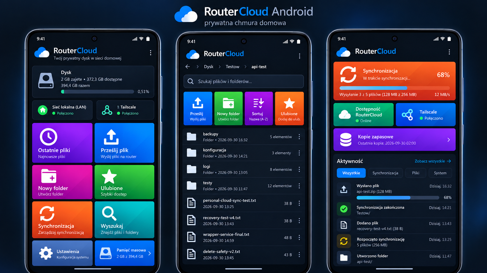

# RouterCloud Android UI concept

**Status:** concept / visual UX direction

## Purpose

This document expands the RouterCloud Metro UI concept for the future private
Android client.

The Android application should feel like the same product as RouterCloud Web,
while remaining a native mobile interface rather than a scaled-down copy of the
desktop page.

## Design language

The Android client should preserve the main RouterCloud design principles:

- dark-mode-first presentation;
- large readable typography;
- large touch targets;
- vivid Metro-inspired tiles;
- simple navigation;
- status information visible without opening multiple screens;
- consistent RouterCloud branding;
- restrained use of conventional Android lists where lists are more practical.

The inspiration comes from Windows Phone, Windows 8 and Windows 10 Mobile, but
the application should remain an original modern Android design.

## Screen 1 — Home dashboard

The home screen acts as the primary RouterCloud control surface.

Primary information:

- RouterCloud branding;
- storage usage;
- LAN connectivity;
- Tailscale connectivity.

Primary tiles:

- Recent files;
- Upload file;
- New folder;
- Favorites;
- Synchronization;
- Search;
- Settings;
- Storage.

The dashboard should expose the most common actions without requiring a
navigation drawer.

## Screen 2 — Files and folders

The file browser should combine Metro-inspired quick actions with a compact
file list.

Recommended elements:

- breadcrumb navigation;
- search;
- upload;
- create folder;
- sorting;
- favorites;
- contextual per-item actions;
- file and folder metadata.

Folders may use a stronger visual treatment than individual files.

A traditional compact list is acceptable here because information density is
more important than forcing every object into a large tile.

## Screen 3 — Synchronization and activity

The synchronization screen should provide live operational feedback.

Recommended status cards:

- current synchronization progress;
- RouterCloud backend availability;
- Tailscale connectivity;
- latest backup state.

Activity history may include:

- uploaded files;
- completed synchronization;
- created folders;
- recently added files;
- synchronization start and completion;
- transfer progress.

## Connectivity model

The Android client should distinguish clearly between:

- local LAN access;
- remote Tailscale access;
- unavailable RouterCloud backend.

The application should not silently fall back to public WAN connectivity.

## Android implementation direction

Preferred implementation:

- Kotlin;
- Jetpack Compose;
- HTTPS;
- Android Keystore for sensitive local credentials;
- Android share-target integration;
- background transfer support;
- resumable upload/download where supported by the backend.

Possible later additions:

- biometric unlock;
- automatic camera backup;
- selective folder synchronization;
- offline metadata cache;
- previews;
- notification support;
- per-device trust controls.

## Security boundary

The mobile application must not become a source of additional RouterCloud
privileges.

The backend remains authoritative for:

- path containment;
- authentication;
- authorization;
- rename behavior;
- overwrite policy;
- DELETE availability.

The application must not contain embedded administrator credentials, private
keys or deployment secrets.

## MVP interaction scope

The first Android MVP should support:

1. authentication/session establishment;
2. browsing files and folders;
3. upload;
4. download/open;
5. folder creation;
6. rename;
7. search;
8. favorites/recent items where backend support exists;
9. storage usage display;
10. LAN versus Tailscale connectivity status.

DELETE should only appear when the backend explicitly permits it.

## Concept board

The following image illustrates three target screens:

1. home dashboard;
2. file browser;
3. synchronization and activity.

It is a visual design target, not evidence of an implemented Android client.

