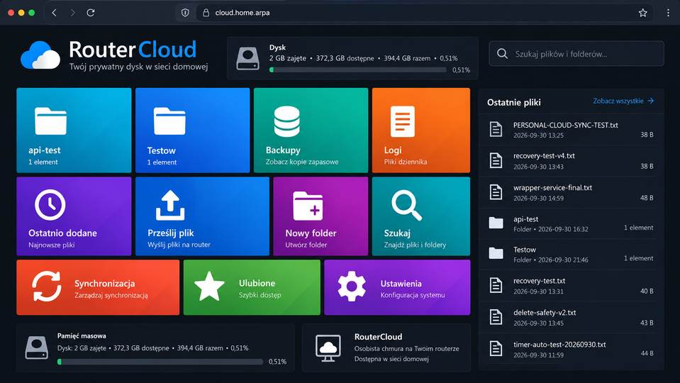

# RouterCloud Metro UI

**Status:** concept / visual UX direction

## Problem

The current RouterCloud browser interface is functional, but visually it still
resembles a conventional file manager.

The intended direction is a more distinctive, fast and touch-friendly interface
for the private RouterCloud service running on the ASUS Edge platform.

## Goal

Create one consistent RouterCloud design language for:

- RouterCloud Web;
- the future private RouterCloud Android client.

The visual direction is inspired by the tile-based interfaces of:

- Windows 8;
- Windows Phone;
- Windows 10 Mobile.

This is inspiration only. The goal is not to copy Microsoft branding or
historical interfaces exactly.

## Why it is interesting

RouterCloud already has a working backend and a defined security boundary.

A dedicated tile-based frontend can turn it from a technically useful browser
file service into a coherent product-like experience without changing the
security model.

The same design system can later be reused by the private Android client.

## Visual direction

Core principles:

- dark-mode-first;
- large typography;
- large touch targets;
- asymmetric and responsive tiles;
- minimal interface chrome;
- quick actions directly on the start screen;
- live/status tiles where useful;
- avoid a generic file-manager appearance on the main screen.

## Candidate dashboard tiles

Initial browser dashboard:

- Files / folders;
- Recent;
- Upload;
- New folder;
- Search;
- Favorites;
- Synchronization;
- Backups;
- Logs;
- Storage;
- Settings.

Potential live values:

- storage usage;
- latest file;
- synchronization state;
- upload progress;
- RouterCloud availability;
- Tailscale connectivity.

## Folder view

The internal folder view may use a hybrid design:

- folders as tiles;
- files as a compact list;
- breadcrumbs;
- search;
- recent actions;
- large upload and create-folder controls.

The main RouterCloud start screen should remain clearly tile-oriented.

## Android client

The private Android client should use the same visual language.

Candidate mobile tiles:

- Files;
- Photos;
- Recent;
- Upload;
- Favorites;
- Sync;
- Storage;
- Router;
- Tailscale;
- Settings.

Possible live tiles:

- upload progress;
- latest synchronized item;
- storage percentage;
- LAN / Tailscale connection state;
- recent photo thumbnail.

The Android client remains a native Kotlin + Jetpack Compose application.
The Metro-inspired layout is a UX layer only.

## Constraints

The redesign must not weaken the current RouterCloud security model.

Required constraints:

- no public WAN exposure;
- LAN and/or Tailscale only;
- application root restricted to RouterCloud storage;
- no access to router internals such as `/jffs`, `/etc` or `/www`;
- backend authorization remains authoritative;
- path containment remains enforced;
- safe rename and no-overwrite behavior remain enforced;
- DELETE availability follows backend policy;
- no secrets embedded in the frontend or Android APK.

## Related work and scope boundary

Related active work includes:

- RouterCloud browser access;
- RouterCloud versioned backup;
- private RouterCloud Android client;
- Edge Gateway service portal.

The operational implementation and runtime evidence remain in the active ASUS
Edge project.

This repository owns the concept, UX direction, MVP boundary and promotion
criteria only.

## Proposed architecture

Browser:

    RouterCloud Web
        |
        +-- Metro-style dashboard
        +-- file/folder browser
        +-- upload / search / favorites / status
        |
        v
    existing RouterCloud backend
        |
        v
    dedicated RouterCloud storage root

Android:

    RouterCloud Android
        |
        +-- native Kotlin / Jetpack Compose
        +-- same tile-based visual language
        |
        v
    existing RouterCloud backend over HTTPS
        |
        +-- LAN
        +-- Tailscale

## MVP

Browser MVP:

1. tile-based RouterCloud start page;
2. storage tile;
3. recent-files tile or panel;
4. upload tile;
5. new-folder tile;
6. search tile;
7. folder navigation;
8. responsive desktop/mobile layout;
9. dark theme;
10. preserve existing backend authorization behavior.

Android implementation remains tracked separately in the active project and
should reuse the same design system once the browser direction is stable.

## Validation

PASS requires:

- responsive rendering on desktop and mobile widths;
- primary actions reachable directly from the start screen;
- practical file browsing;
- no regression in upload/download/create/rename behavior;
- no expansion of backend privileges;
- unchanged LAN/Tailscale access boundaries;
- visual acceptance of the tile-based design.

Screenshots alone are not implementation evidence. Functional and security
validation remains required.

## Risks and rollback

Primary risks:

- excessive visual styling making file management slower;
- poor mobile scaling;
- duplicating backend logic in the frontend;
- unsafe file actions;
- coupling UI code to router filesystem internals.

Rollback should remain simple:

- restore the previous RouterCloud frontend;
- leave the RouterCloud backend unchanged.

## Public-data boundary

Do not publish:

- private IP addresses;
- credentials;
- tokens;
- personal filenames;
- private RouterCloud contents;
- device secrets;
- raw access logs.

Mockups should use synthetic example data only.

## Promotion criterion

Promote this idea into active RouterCloud implementation when:

1. the tile layout and navigation model are accepted;
2. the browser MVP scope is stable;
3. backend behavior is stable;
4. the Android client can reuse the same visual language.

## Concept visualization

The image below is a design target, not evidence of a deployed interface.

## Android concept visualization

The mobile design has been expanded into a dedicated Android concept covering
the dashboard, file browser and synchronization/activity views.

See [ANDROID-UI.md](ANDROID-UI.md) for the detailed mobile UX direction.

